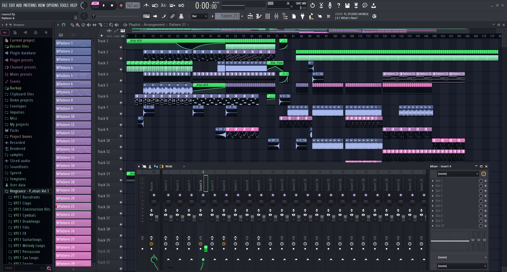

# Dracula for [FL Studio 21](https://www.image-line.com)

> A dark theme for [FL Studio 21](https://www.image-line.com).

## Install

All instructions can be found at [draculatheme.com/fl-studio-21](https://draculatheme.com/fl-studio-21).

## Team

This theme is maintained by the following person(s) and a bunch of [awesome contributors](https://github.com/dracula/fl-studio-21/graphs/contributors).

|  |  |
| ------------------------------------------------------------------------------------- | ------------------------------------------------------------------------------ |
| [Bill Tansey](https://github.com/TanZboi)                                             |  [EDM115](https://github.com/EDM115)                                           |

## Community

- [Twitter](https://twitter.com/draculatheme) - Best for getting updates about themes and new stuff.
- [GitHub](https://github.com/dracula/dracula-theme/discussions) - Best for asking questions and discussing issues.
- [Discord](https://draculatheme.com/discord-invite) - Best for hanging out with the community.

## License

[MIT License](./LICENSE)
